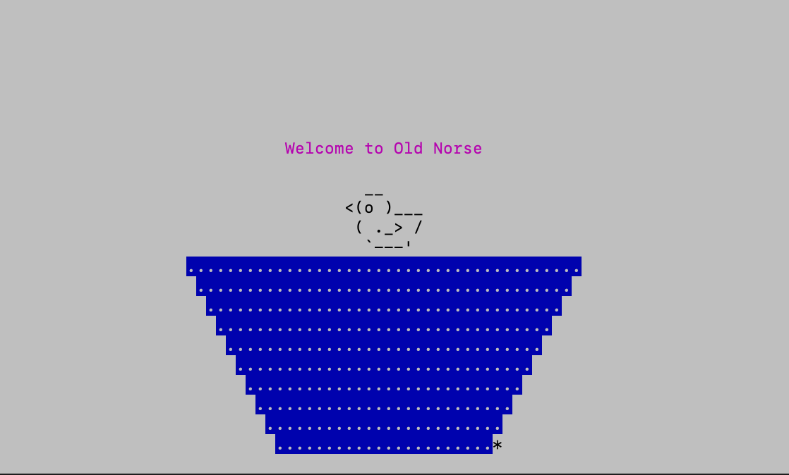
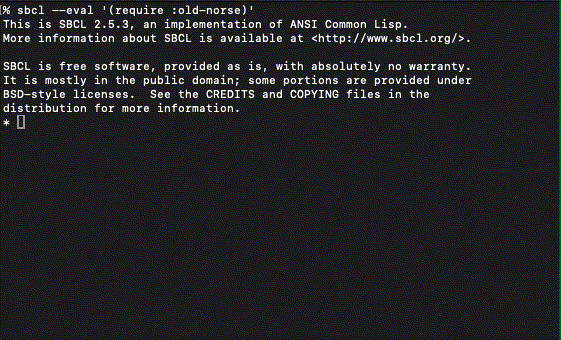

#  Old Norse - fast, mouse-driven terminal apps in Common Lisp

Build internal tools, monitoring dashboards, and retro ASCII games in Common Lisp

Features: Mouse support, 60fps rendering, deploy anywhere via SSH or [TTYD](https://tsl0922.github.io/ttyd/)

Core libraries (terminal UI):
 - [Bifrost](bifrost/) 🌈 - low-level terminal control
 - [Skald](skald/) - sprites & rendering
 - [Flokkr](flokkr/) - timing & user input
 - [Meadhorn](meadhorn/) - debugging

Coming soon!
 - [Sixel graphics](https://en.wikipedia.org/wiki/Sixel) - dot matrix printer graphic image format

Old Norse is implementation-dependent on SBCL.

## Quick start

**Run these examples in the terminal, not SLIME/EMACS**

Example: styling and alignment

```lisp
(bifrost:with-bifrost                       ; Enter raw terminal mode
  (skald:skald-init :fg :black :bg :white)  ; Initialize buffers & clear screen
  (skald:skald                              ; Open a draw transaction
    (skald:span ((- skald:*screen-center-row* 4)
                 skald:*screen-center-col*
                 :fg :magenta
                 :align :center)
      "Welcome to Old Norse")
    (skald:sprite ((- skald:*screen-center-row* 2) 
                   skald:*screen-center-col* 
                   :align :center)
      "  __"
      "<(o )___"
      " ( ._> /"
      "  `---'")
    (dotimes (i 10)
      (skald:span ((+ i 2 skald:*screen-center-row*) skald:*screen-center-col*
                   :bg :blue :fg :white :align :center)
        (make-string (- 40 (* i 2)) :initial-element #\.)))))
```



Example: fast animation that follows mouse movement

```lisp
(bifrost:with-bifrost
  (skald:skald-init :bg :white :fg :blue)
  (bifrost:with-mouse-tracking (1003)                   ; start tracking mouse movement
    (flokkr:flokkr                                      ; enter flokkr loop
      (:input
        (:mouse-click-left (return-from flokkr:flokkr)) ; on left click, exit
        (:mouse-move                                    ; on mouse move, reposition sprite
         (skald:skald
           (skald:sprite ((first bifrost:*rune-payload*) (second bifrost:*rune-payload*) :align :center)
                "╔═══════╗"
                "║  🌍   ║"
                "║ hello ║"
                "║ world ║"
                "╚═══════╝")))))))
```




Simultaneous mouse movement tracking + animation timing loops

```lisp
(bifrost:with-bifrost                          ; low-level setup
  (skald:skald-init)                           ; clear the screen
  (bifrost:with-mouse-tracking (1003)          ; track mouse hover events
    (bifrost:with-cbox-layer :new
      (let ((seconds 0)
            (row 1)
            (col 1))
        (flokkr:flokkr
          (:after 1 :do (incf counter) :repeat) ; every second, advance the timer
          (:input
            (:mouse-click-left (return-from flokkr:flokkr)) ; on left click, exit
            (:mouse-move                                    ; on mouse move, reposition
             (setf row (first *rune-payload*)
                   col (second *rune-payload*))))
          (:also (skald:skald         ; if either of the above happened, re-render
                   (skald:span (row col :foreground cyan)
                     (format nil "~a seconds" seconds)))))))))
```


## Design pillars

## (1) Low-level grid-based terminal graphics engine

Old Norse doesn't provide you with a widget for making a status bar. It provides you with tools to draw sprites to the screen & animate them according to precise timing logic, so that you can make your own custom status bar. The goal of the library is to make it easy to prototype a wide array of experimental game mechanics and interfaces, so long as they can be represented on a chunky terminal grid, within the constraints of a Unix-like terminal emulator.
 
Our roadmap plan is to add support for [sixel graphics](https://en.wikipedia.org/wiki/Sixel). This will allow us to animate graphic images. However, the terminal grid will still remain the only coordinate system. Sixel sprites will snap to the same terminal grid as ASCII characters.

## (2) UX speed & precision timing

Timing is critical to games. Even klunky prototypes. Speed & responsiveness are important to any kind of user application. 

The Old Norse design goals are:
 1. 60fps animation (assumes normal screen size) 
 2. Update screen in under 16ms after user input (local, before factoring in network latency)
 3. High-precision control of timings & interactive behavior

Based on our observation, TUI applications can achieve this by managing the following bottlenecks:
1. Efficient diff-based screen updates - provided by SKALD
2. Immediate response to user input - provided by FLOKKR
3. Get slow DB queries & cloud API calls out of main loop - Currently must be managed by the user. But there is a roadmap plan to add a new flokkr form to support async io.
4. Strategic scheduling of GC pauses -  Must be managed by the user. (Note: bifrost/skald do produce GC pressure when running. There is a roadmap plan to reduce it over time.)
5. When deploying remotely, deploy in-region - must be managed by the user.
  
## (3) Develop in an hour. Deploy anywhere.

The goal is to think of an idea, implement it quickly, then get it in front of other people for feedback right away.

Focus on rapid development
- 1:1 mapping between back-end SBCL program & client session
- DSL-based approach

Easy remote deployment
- SSH
- Browser-based via [TTYD](https://tsl0922.github.io/ttyd/).

In the future, we plan to provide:
- Documented playbooks & strategies for cloud deployment (fly.io, hetzer, aws)
- Enhanced support for mobile web deployment (cbox swiping, rendering)

## (4) Old Norse "high locality" coding style

If not structured correctly, even the simplest Terminal UI application can grow into a complicated mess of spaghetti code. The Old Norse way to deal with this is by prioritizing locality. In other words, the TUI application code structure should put related logic close together.

1. JUST ONE FUNCTION TO RENDER THE ENTIRE SCREEN - SKALD-DRAW makes efficient diff-based screen updates, only updating sections of the that have recently changed. This allows you to define a single function to draw the entire screen, and then call it however frequently you want, relying on SKALD's low-level optimization to eliminate unecessay redrawing.

2. JUST ONE CONTROL STRUCTURE - FLOKKR makes it possible to put all timing logic & input reaction logic in one place, making it easier to reason about timing & interactive behaviors. Modular composability is still possible, but within rigid constraints (chaining via :SUBFLOKKR) to help prevent hidden scheduling issues.

In practice, we have found this design pattern to *DRASTICALLY* simplify & shorten TUI application codebases.

## The Old Norse terminal toolkit libraries 

### Bifrost 🌈
[Bifrost](bifrost/) is a low-level utility for reading from & controlling the terminal. Used by skald & flokkr
- Two-way mapping between ASCII escape sequences & s-expressions
- Mouse event tracking logic (click/hover)
- Raw I/O to bypass terminal read buffer (but also debugging modes to troubleshoot TUI applications within SLIME/EMACS)

### Skald
[Skald](skald/) is a high-level terminal UI and animation framework
- Treat blocks of ASCII/unicode text as sprites (transparant char enables composite layering)
- Efficient diff-based screen updates for fast redrawing with minimal flicker
- Grid-based positioning/layout/alignment, foreground/background colors, cropping/fill, emojis, etc

### Flokkr
[Flokkr](flokkr/) is a concurrency library purpose-built for building interactive TUI applications with skald/bifrost.
- Manage complex timing & behaviors loops via mini-DSL (inspired by the LOOP macro)
- Respond instantly to terminal input from user (without relying on polling)
- Define widget/object timing behaviors seperately, then compose via :SUBFLOCKKR

### Meadhorn
[Meadhorn](meadhorn/) is a simple debugging utility. 
- Print statements are a simple, powerful debugging tool. But when developing terminal applications, they mess up the display. MEADHORN:MH is just like FORMAT except that it broadcasts output to a Unix socket. Read it with [netcat](https://en.wikipedia.org/wiki/Netcat) for simple print-statement based debuging without disrupting the terminal UI.

### Old Norse
You can load all of these libraries via the umbrella package `(require :old-norse)`

## Requirements
1. Requires a Unix-like terminal emulator that implements standard TTY interface. It must support SGR mode (required for larger grid size). Examples: xterm, gnome-terminal, iTerm2, Mac OS X Terminal, TTYD, etc
2. Old Norse is implementation-dependent on [SBCL](https://www.sbcl.org/)
3. Old Norse requires quicklisp installable [TRIVIAL-RAW-IO](https://github.com/kingcons/trivial-raw-io) library
4. If you want to use mouse tracking features, the terminal must support XTERM mouse tracking protocol. (Most modern terminal emulators do.)
5. In order for ASCII sprites to line up correctly, your terminal window needs to be using monospaced font.
  - For example, here is how to do that with TTYD:

        ttyd -t fontFamily="'Courier','Lucinda Console','Roboto Mono','Courier New','Monospace'" -p 8080 --writable sbcl

## Recommended conventions

We have found the following prefix naming conventions to be useful when structuring our own TUIs:

```lisp 
;;   <r>-row        row coordinate on the terminal grid (sometimes called Y)
;;   <c>-column     column coordinate on the terminal grid (sometimes called X)
;;   <rc>-point     a cons of (ROW . COLUMN). Sometimes called a "point"
;;   [d]-duration   duration of seconds elapsed or for a timer to wait
;;   [%]-progress   for tracking transition from 0.0 to 1.0 (state machine or animation)
;;   [n]-ticks      number of ticks/frames for something to run (eg for an animation)
```

## Status

v0.0 - Core API subject to change

## Lispy alternatives

- [cl-tuition](https://github.com/atgreen/cl-tuition) - Common Lisp library for building rich, responsive terminal user interfaces (TUIs). It blends the simplicity of TEA with the power of CLOS so you can model state clearly, react to events via generic methods, and render your UI as pure strings.
- [text-draw](https://shinmera.github.io/text-draw/) - Common Lisp functions to draw graphics using pure Unicode text.

## License

MIT
